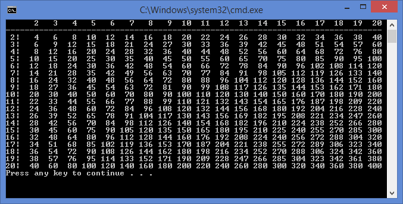

# Multiplication table

Programmet åstadkommer nedanstående konsollutskrift av multiplikationstabellen, med användning av nästlade ```for```-loopar och formatfält.

___Konsollfönster___




## Läs

Du hittar mer matnyttigt om formatering i artikeln: [Hur formaterar jag numeriska värden?](https://github.com/1dv024/kursinnehall/blob/master/resurser/hur-formaterar-jag-numeriska-varden.pdf "Vad är en metod?").